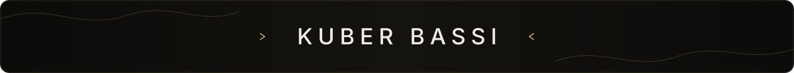
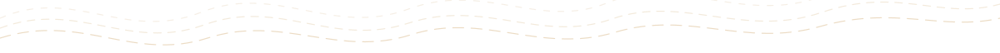

**Independent engineer & product thinker**

Full-stack development · Product engineering · AI & automation

*Turning ideas into clean, useful, and reliable digital products.*

<table>
<tr>
<td align="center"><a href="https://kuberbassi.com"> <strong>Website</strong></a></td>
<td align="center"><a href="#selected-work"> <strong>Projects</strong></a></td>
<td align="center"><a href="https://github.com/kuberbassi?tab=repositories"> <strong>GitHub</strong></a></td>
<td align="center"><a href="https://www.linkedin.com/in/kuberbassi/"> <strong>LinkedIn</strong></a></td>
</tr>
</table>

## Selected Work

| Project | Product | Toolkit | Links |
| :--- | :--- | :--- | :--- |
| **Savewave** | Private media saving across desktop and Android. | `JavaScript` `Android` `Desktop` | [Live](https://savewave.kuberbassi.com) · [Source](https://github.com/kuberbassi/savewave) |
| **Compactor** | Private browser tools for lighter, tidier files. | `TypeScript` `React` `Web APIs` | [Live](https://compactor.kuberbassi.com) · [Source](https://github.com/kuberbassi/compactor) |
| **Semester** | An academic operating system for classes, attendance, and focus. | `TypeScript` `Next.js` `PostgreSQL` | [Live](https://semester.kuberbassi.com) · [Source](https://github.com/kuberbassi/semester) |
| **YouTube Music Scrobbler** | Automatic Last.fm scrobbling from central listening history. | `Python` `YouTube` `Last.fm` | [Live](https://ytscrobbler.kuberbassi.com) · [Source](https://github.com/kuberbassi/ytmusic-scrobbler) |

[Explore all repositories →](https://github.com/kuberbassi?tab=repositories)

## Toolkit

<table>
<tr>
<td width="33%" align="center">
<strong>PRODUCT</strong>  
&nbsp;&nbsp;
&nbsp;&nbsp;
&nbsp;&nbsp;
 
TypeScript · React · Next.js · Vite
</td>
<td width="34%" align="center">
<strong>SYSTEMS</strong>  
&nbsp;&nbsp;
&nbsp;&nbsp;
&nbsp;&nbsp;
 
Node.js · Python · FastAPI · PostgreSQL
</td>
<td width="33%" align="center">
<strong>PLATFORM</strong>  
&nbsp;&nbsp;
&nbsp;&nbsp;
&nbsp;&nbsp;
 
Supabase · Docker · GitHub · Vercel
</td>
</tr>
</table>

## Education

B.Tech in Computer Science · **GGSIPU, Delhi** · 2025–2029

## Music

Guitarist and music producer releasing original music as **KUβER βΔSSI** · [Spotify](https://open.spotify.com/artist/1hVnV9LmM1EJpA8Gj0iT0H) · [YouTube](https://www.youtube.com/channel/UCcw12FyihnsK7TEHFBVHApw)

## Organizations

<table>
<tr>
<td width="50%" align="center">
<a href="https://github.com/kuberbassi-labs"> <strong>kuberbassi-labs</strong></a>
</td>
<td width="50%" align="center">
<a href="https://github.com/VanguardLogic"> <strong>VanguardLogic</strong></a>
</td>
</tr>
</table>

 

**Build. Learn. Ship.**

[kuberbassi.com](https://kuberbassi.com) &nbsp;·&nbsp; [LinkedIn](https://www.linkedin.com/in/kuberbassi/) &nbsp;·&nbsp; [Email](mailto:me@kuberbassi.com) &nbsp;·&nbsp; New Delhi, India

